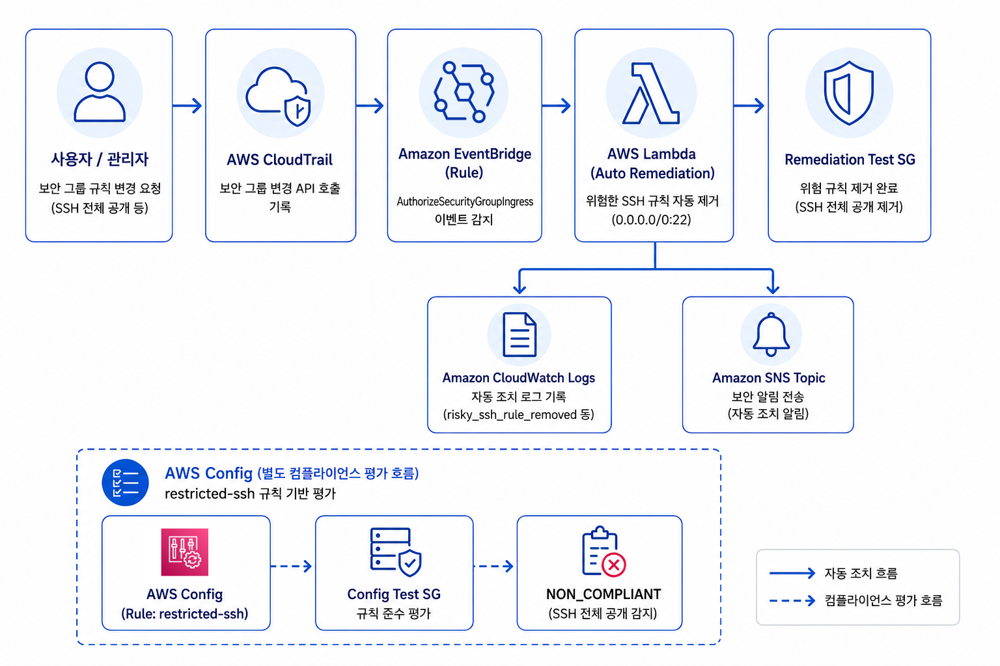
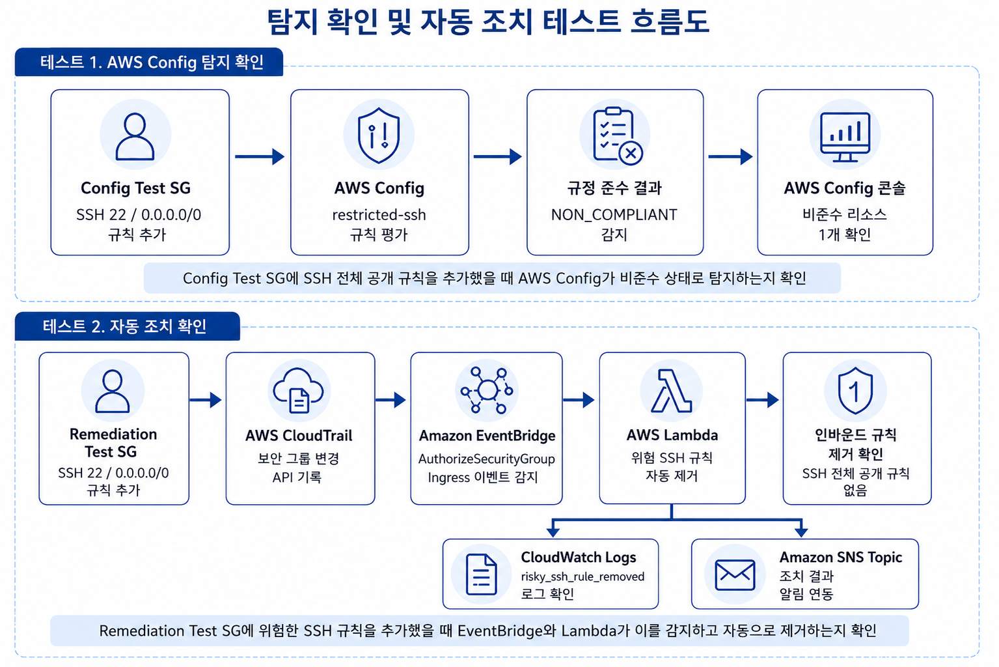
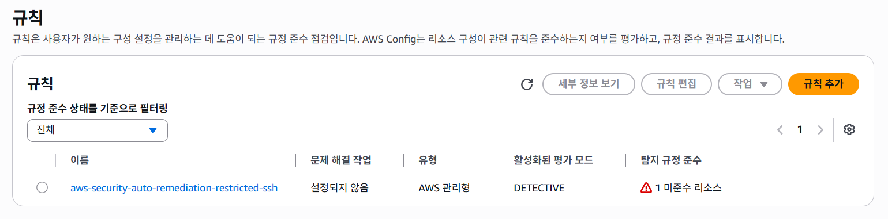
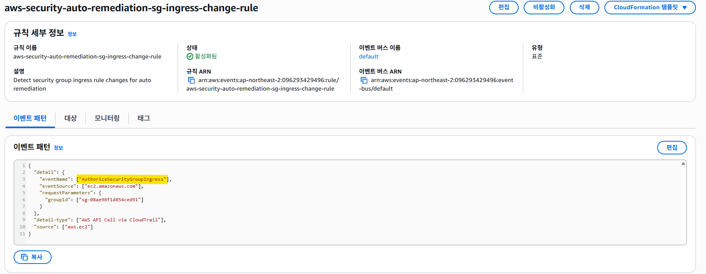
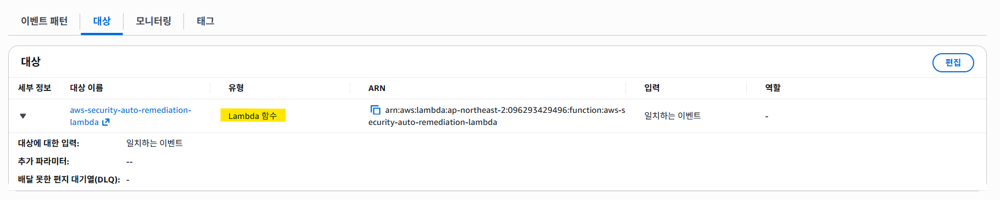
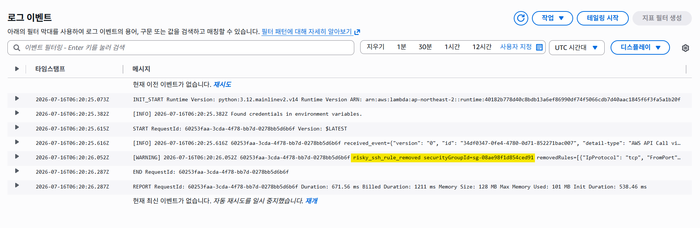
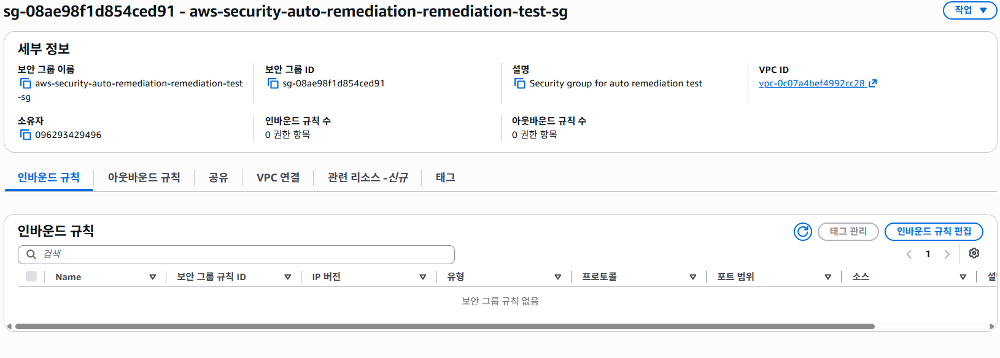

# AWS Security Auto Remediation 실습 - 보안 그룹 위험 규칙 자동 조치

## 1. 프로젝트 개요

이 프로젝트는 AWS 운영 실습 시리즈 4차 프로젝트입니다.

1차 실습에서는 EC2, ALB, Target Group, CloudWatch Alarm을 활용해 Linux 서버 운영과 장애 1차 대응 흐름을 확인했습니다.

2차 실습에서는 Private Subnet, Bastion Host, Auto Scaling Group, Terraform을 활용해 운영 환경에 더 가까운 서버 구조를 구성했습니다.

3차 실습에서는 API Gateway, Lambda, DynamoDB, SQS, CloudWatch, GitHub Actions OIDC를 활용해 Serverless API 운영과 자동 배포 흐름을 구성했습니다.

이번 4차 실습에서는 보안 그룹에 위험한 SSH 전체 공개 규칙이 추가되었을 때, AWS Config로 규정 위반 여부를 확인하고, CloudTrail과 EventBridge를 통해 보안 그룹 변경 이벤트를 감지한 뒤 Lambda가 위험 규칙을 자동으로 제거하는 보안 자동 조치 흐름을 구성했습니다.

Terraform을 사용해 VPC, Security Group, CloudTrail, EventBridge, Lambda, AWS Config, CloudWatch Logs, SNS Topic, S3 Audit Bucket을 코드로 구성하고, 실습 종료 후 terraform destroy로 전체 리소스를 정리했습니다.

---

## 2. 프로젝트 목표

- 보안 그룹 SSH 전체 공개 규칙의 위험성 이해
- AWS Config를 통한 보안 그룹 규정 준수 평가 확인
- CloudTrail을 통한 보안 그룹 변경 API 기록 확인
- EventBridge를 통한 보안 이벤트 감지 흐름 구성
- Lambda를 활용한 위험 인바운드 규칙 자동 제거
- CloudWatch Logs를 통한 자동 조치 이력 확인
- SNS Topic을 통한 알림 연동 구성
- Terraform을 활용한 보안 자동 조치 인프라 코드화
- 실습 종료 후 리소스 삭제 및 비용 안전 조치 수행

---

## 3. 기술 스택

| 구분 | 기술 |
|---|---|
| Cloud | AWS VPC, Security Group |
| Security Detection | AWS Config, CloudTrail |
| Event | Amazon EventBridge |
| Auto Remediation | AWS Lambda |
| Monitoring | CloudWatch Logs |
| Notification | SNS Topic |
| Storage | S3 Audit Bucket |
| IaC | Terraform |
| Language | Python |
| Tool | PowerShell, VSCode, AWS CLI |
| Documentation | Markdown |

---

## 4. 프로젝트 구조

```text
aws-security-auto-remediation
├─ docs
│  └─ images
│     ├─ 00-security-auto-remediation-flow.png
│     ├─ 01-config-restricted-ssh-non-compliant.png
│     ├─ 02-cloudwatch-lambda-remediation-logs.png
│     ├─ 03-remediation-sg-rule-removed-after.png
│     ├─ 04-1-eventbridge-event-pattern.png
│     ├─ 04-2-eventbridge-lambda-target.png
│     └─ 05-security-auto-remediation-test-flow.png
├─ lambda
│  └─ remediate_sg.py
├─ .gitignore
├─ .terraform.lock.hcl
├─ main.tf
├─ outputs.tf
├─ provider.tf
├─ terraform.tfvars.example
├─ variables.tf
└─ README.md
```

---

## 5. 보안 자동 조치 구성 흐름



보안 그룹 변경 이벤트가 발생했을 때 자동 조치 흐름은 다음과 같습니다.

```text
사용자 / 관리자
    ↓
보안 그룹 인바운드 규칙 변경
    ↓
AWS CloudTrail
    ↓
Amazon EventBridge Rule
    ↓
AWS Lambda
    ↓
위험 SSH 규칙 자동 제거
```

자동 조치 결과는 CloudWatch Logs와 SNS Topic으로 연동했습니다.

```text
AWS Lambda
    ├─ CloudWatch Logs
    └─ SNS Topic
```

AWS Config는 별도의 컴플라이언스 평가 흐름으로 구성했습니다.

```text
AWS Config restricted-ssh Rule
    ↓
Config Test SG 평가
    ↓
NON_COMPLIANT 확인
```

---

## 6. 테스트용 보안 그룹 분리

이번 실습에서는 테스트 목적을 분리하기 위해 보안 그룹을 2개로 구성했습니다.

| 보안 그룹 | 목적 |
|---|---|
| Config Test SG | AWS Config가 SSH 전체 공개 규칙을 비준수로 탐지하는지 확인 |
| Remediation Test SG | EventBridge와 Lambda가 위험 규칙을 자동 제거하는지 확인 |

두 보안 그룹을 분리한 이유는 Lambda가 위험 규칙을 즉시 제거하면 AWS Config에서 NON_COMPLIANT 상태를 확인하기 어렵기 때문입니다.

따라서 Config Test SG는 탐지 확인용으로 사용하고, Remediation Test SG는 자동 조치 확인용으로 사용했습니다.

---

## 7. 테스트 흐름



이번 실습은 두 가지 테스트로 나누어 진행했습니다.

### 7.1 AWS Config 탐지 확인 테스트

Config Test SG에 SSH 22번 포트가 `0.0.0.0/0`으로 열리는 규칙을 추가했습니다.

```text
Config Test SG
    ↓
SSH 22 / 0.0.0.0/0 규칙 추가
    ↓
AWS Config restricted-ssh 규칙 평가
    ↓
NON_COMPLIANT 감지
    ↓
AWS Config 콘솔에서 비준수 리소스 확인
```

### 7.2 자동 조치 확인 테스트

Remediation Test SG에 SSH 22번 포트가 `0.0.0.0/0`으로 열리는 규칙을 추가했습니다.

```text
Remediation Test SG
    ↓
SSH 22 / 0.0.0.0/0 규칙 추가
    ↓
CloudTrail API 기록
    ↓
EventBridge 이벤트 감지
    ↓
Lambda 자동 조치 실행
    ↓
위험 SSH 규칙 제거
    ↓
보안 그룹 인바운드 규칙 제거 확인
```

---

## 8. AWS Config 구성

AWS Config는 보안 그룹의 규정 준수 상태를 평가하기 위해 구성했습니다.

사용한 관리형 규칙은 다음과 같습니다.

```text
restricted-ssh
source_identifier = INCOMING_SSH_DISABLED
```

이 규칙은 SSH 인바운드 트래픽이 `0.0.0.0/0` 또는 `::/0`으로 열려 있는지 평가합니다.

Config Test SG에 SSH 전체 공개 규칙을 추가한 뒤, AWS Config에서 비준수 리소스가 탐지되는 것을 확인했습니다.



확인 결과:

```text
aws-security-auto-remediation-restricted-ssh
1 비준수 리소스
```

---

## 9. CloudTrail 구성

CloudTrail은 보안 그룹 변경 API 호출을 기록하기 위해 구성했습니다.

이번 실습에서 EventBridge가 감지한 주요 이벤트는 다음과 같습니다.

```text
AuthorizeSecurityGroupIngress
```

이 이벤트는 보안 그룹에 인바운드 규칙이 추가될 때 발생합니다.

CloudTrail은 해당 API 호출을 기록하고, EventBridge는 이 이벤트를 조건에 맞게 감지합니다.

---

## 10. EventBridge 구성

EventBridge Rule은 CloudTrail 이벤트 중 보안 그룹 인바운드 규칙 추가 이벤트를 감지하도록 구성했습니다.

감지 조건은 다음과 같습니다.

```text
source: aws.ec2
detail-type: AWS API Call via CloudTrail
eventName: AuthorizeSecurityGroupIngress
groupId: Remediation Test SG
```



EventBridge Rule의 대상은 Lambda 함수로 설정했습니다.



이를 통해 Remediation Test SG에 인바운드 규칙이 추가되면 Lambda 자동 조치 함수가 실행되도록 구성했습니다.

---

## 11. Lambda 자동 조치 구성

Lambda는 EventBridge에서 전달받은 CloudTrail 이벤트를 기반으로 동작합니다.

Lambda 함수 파일:

```text
lambda/remediate_sg.py
```

Lambda의 주요 동작은 다음과 같습니다.

```text
1. EventBridge 이벤트 수신
2. 이벤트 이름이 AuthorizeSecurityGroupIngress인지 확인
3. 대상 Security Group이 Remediation Test SG인지 확인
4. SSH 22번 포트가 0.0.0.0/0 또는 ::/0으로 열렸는지 확인
5. 위험 규칙이면 revoke_security_group_ingress 호출
6. CloudWatch Logs에 조치 결과 기록
7. SNS Topic으로 조치 결과 발행
```

자동 조치 대상은 Remediation Test SG로 제한했습니다.

```text
TARGET_SECURITY_GROUP_ID = remediation-test-sg
```

이를 통해 Config Test SG는 AWS Config 탐지 확인용으로 유지하고, Remediation Test SG만 자동 조치 대상이 되도록 구성했습니다.

---

## 12. CloudWatch Logs 확인

Lambda 자동 조치 결과는 CloudWatch Logs에서 확인했습니다.

Log Group:

```text
/aws/lambda/aws-security-auto-remediation-lambda
```

Remediation Test SG에 위험한 SSH 전체 공개 규칙을 추가한 뒤, CloudWatch Logs에서 다음 로그를 확인했습니다.

```text
risky_ssh_rule_removed
```



이는 Lambda가 위험한 SSH 인바운드 규칙을 감지하고 자동으로 제거했음을 의미합니다.

---

## 13. 보안 그룹 자동 제거 결과 확인

Lambda 자동 조치 후 Remediation Test SG의 인바운드 규칙을 확인했습니다.



확인 결과:

```text
인바운드 규칙 수: 0
보안 그룹 규칙 없음
```

이는 SSH 22번 포트 `0.0.0.0/0` 규칙이 자동으로 제거되었음을 의미합니다.

---

## 14. SNS Topic 구성

Lambda는 자동 조치 결과를 SNS Topic으로 발행하도록 구성했습니다.

SNS Topic:

```text
aws-security-auto-remediation-remediation-topic
```

이번 실습에서는 이메일 수신 자체보다, Lambda가 조치 결과를 SNS Topic으로 발행하도록 연동한 구조를 중심으로 확인했습니다.

---

## 15. Terraform 구성

Terraform을 사용해 AWS 인프라를 코드로 구성했습니다.

| 파일 | 역할 |
|---|---|
| provider.tf | AWS Provider, archive provider, random provider 설정 |
| variables.tf | AWS Region, Profile, Project Name, Email 변수 정의 |
| main.tf | 주요 AWS 리소스 정의 |
| outputs.tf | Security Group ID, Lambda 이름, Config Rule 이름 등 출력 |
| terraform.tfvars.example | 사용자 설정값 예시 |
| lambda/remediate_sg.py | 보안 그룹 자동 조치 Lambda 코드 |

Terraform으로 생성한 주요 리소스는 다음과 같습니다.

```text
VPC
Config Test Security Group
Remediation Test Security Group
S3 Audit Bucket
CloudTrail
EventBridge Rule
Lambda Function
Lambda IAM Role / Policy
CloudWatch Log Group
SNS Topic
AWS Config Recorder
AWS Config Delivery Channel
AWS Config restricted-ssh Rule
```

실행 흐름:

```bash
terraform fmt
terraform init
terraform validate
terraform plan -out=tfplan
terraform apply "tfplan"
```

실습 종료 후 리소스 정리:

```bash
terraform destroy
```

---

## 16. 테스트 시나리오

### 16.1 Terraform 인프라 생성

```bash
terraform plan -out=tfplan
terraform apply "tfplan"
```

결과:

```text
VPC, Security Group, CloudTrail, EventBridge, Lambda, AWS Config, CloudWatch Logs, SNS, S3 생성 성공
```

### 16.2 AWS Config 탐지 테스트

Config Test SG에 위험한 SSH 전체 공개 규칙을 추가했습니다.

```bash
aws ec2 authorize-security-group-ingress \
  --group-id <config-test-sg-id> \
  --protocol tcp \
  --port 22 \
  --cidr 0.0.0.0/0
```

결과:

```text
AWS Config restricted-ssh 규칙에서 NON_COMPLIANT 감지
```

### 16.3 자동 조치 테스트

Remediation Test SG에 위험한 SSH 전체 공개 규칙을 추가했습니다.

```bash
aws ec2 authorize-security-group-ingress \
  --group-id <remediation-test-sg-id> \
  --protocol tcp \
  --port 22 \
  --cidr 0.0.0.0/0
```

결과:

```text
CloudTrail 기록
EventBridge 이벤트 감지
Lambda 자동 실행
위험 SSH 규칙 자동 제거
CloudWatch Logs에서 risky_ssh_rule_removed 확인
```

### 16.4 리소스 정리

```bash
terraform destroy
```

결과:

```text
실습 리소스 삭제 완료
```

---

## 17. 트러블슈팅

### 17.1 S3 Lifecycle 경고

Terraform validate 실행 중 S3 Lifecycle 설정에서 경고가 발생했습니다.

경고 내용:

```text
No attribute specified when one of filter or prefix is required
```

원인:

```text
S3 Lifecycle Rule에 적용 대상 필터가 명확히 지정되지 않음
```

해결:

```hcl
filter {
  prefix = ""
}
```

버킷 전체 객체에 대해 7일 후 만료 규칙이 적용되도록 수정했습니다.

### 17.2 AWS CLI Access Key 재등록

3차 실습 종료 후 Access Key를 삭제했기 때문에 기존 AWS CLI 프로필로는 AWS API 호출이 불가능했습니다.

확인된 오류:

```text
InvalidClientTokenId
```

해결:

```bash
aws configure --profile yujin-terraform-practice
```

새 Access Key를 생성한 뒤 기존 프로필에 다시 등록했습니다.

### 17.3 Lambda 자동 조치 캡처 문제

Remediation Test SG에 위험 규칙을 추가한 뒤, 규칙이 너무 빠르게 제거되어 추가 직후 화면을 캡처하기 어려웠습니다.

해결:

```text
CloudWatch Logs에서 risky_ssh_rule_removed 로그 확인
보안 그룹 인바운드 규칙이 제거된 상태 확인
```

이를 통해 자동 조치가 정상 동작했음을 검증했습니다.

---

## 18. 비용 및 보안 정리

이번 실습은 AWS Config, CloudTrail, S3, Lambda, CloudWatch Logs 등 과금 가능 리소스를 포함했습니다.

비용 관리를 위해 다음 설정을 적용했습니다.

```text
EC2 미사용
ALB 미사용
NAT Gateway 미사용
RDS 미사용
EKS 미사용
S3 Lifecycle 7일 만료 설정
CloudWatch Log Group retention 1일 설정
```

실습 종료 후 다음 작업을 수행했습니다.

```text
terraform destroy 실행
terraform state list 결과 확인
AWS 콘솔에서 주요 리소스 삭제 확인
IAM Access Key 삭제
비용 및 크레딧 확인
```

GitHub에 민감한 파일이 올라가지 않도록 `.gitignore`를 구성했습니다.

```gitignore
.terraform/
*.tfstate
*.tfstate.*
*.tfvars
tfplan*
crash.log
crash.*.log
*.zip
__pycache__/
*.pyc
.env
*.pem
*.key
.DS_Store
.vscode/
```

실제 설정값이 들어간 `terraform.tfvars` 대신 `terraform.tfvars.example` 파일만 포함했습니다.

---

## 19. 프로젝트 결과

- AWS Config를 통해 SSH 전체 공개 보안 그룹을 비준수로 탐지했습니다.
- CloudTrail로 보안 그룹 인바운드 규칙 추가 API 호출을 기록했습니다.
- EventBridge로 `AuthorizeSecurityGroupIngress` 이벤트를 감지했습니다.
- Lambda로 위험한 SSH 전체 공개 규칙을 자동 제거했습니다.
- CloudWatch Logs에서 자동 조치 결과를 확인했습니다.
- SNS Topic으로 자동 조치 결과 알림 연동을 구성했습니다.
- Terraform으로 보안 자동 조치 인프라를 코드화했습니다.
- 실습 종료 후 리소스를 삭제하고 Access Key를 정리했습니다.

---

## 20. 프로젝트를 통해 배운 점

이번 실습을 통해 보안 그룹의 위험한 인바운드 규칙을 수동으로 점검하는 방식이 아니라, AWS 이벤트 기반으로 자동 감지하고 조치하는 흐름을 경험했습니다.

AWS Config를 사용해 보안 그룹의 규정 준수 여부를 평가하면서, 보안 설정을 컴플라이언스 관점에서 확인하는 방식을 이해했습니다.

CloudTrail과 EventBridge를 연결하여 보안 그룹 변경 API 호출을 이벤트로 감지하고, Lambda를 실행하는 이벤트 기반 자동화 구조를 구성했습니다.

Lambda에서는 이벤트 내용을 확인한 뒤, 특정 보안 그룹에 대해 SSH 22번 포트가 전체 공개되었는지 검사하고 위험 규칙을 제거하도록 구현했습니다.

또한 CloudWatch Logs를 통해 자동 조치 결과를 확인하면서, 자동화된 보안 조치에서도 로그와 이력 확인이 중요하다는 점을 이해했습니다.

마지막으로 Terraform을 사용해 보안 탐지, 자동 조치, 로그, 알림, 감사 저장소를 코드로 구성하면서 IaC 기반 보안 운영 자동화의 흐름을 경험했습니다.

---

## 21. 향후 보완점

- Security Hub 연동을 통한 보안 Finding 중앙화
- GuardDuty 연동을 통한 위협 탐지 이벤트 확장
- AWS Config Auto Remediation 또는 SSM Automation Runbook 방식 비교
- 예외 태그 기반 자동 조치 제외 기능 추가
- Slack 또는 이메일 알림 채널 확장
- Terraform 파일 모듈화
- GitHub Actions를 활용한 Terraform plan 자동화
- 운영 Runbook 문서화